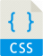

      
    

    <h3 align="center" ;">
      <a
        href="https://www.frontendmentor.io/solutions/react-js-using-css-qiZ4xTBsy"
      >
        Test project from Frontend Mentor
      </a>
    </h3>
    <h3 align="center" ;">
      <a
        href="https://www.frontendmentor.io/solutions/react-js-using-css-qiZ4xTBsy"
      >
        Demo on Vercel
      </a>
    </h3>
  <h2>
   tek
  </h2>
    <table>
        <td>
        

          
        

      </td>
        <td>
        

          
        

      </td>
      <td>
        

          
        

      </td>
      </table>
       <h2>
          Stack
         </h2>
               

                 
               

                

                  
                

                  

                    
                  

                                    <h2>
                      Project Goals
                     </h2>
                     

- :electric_plug: Putting React learning into practice 
- :wave: Understand some concepts in practice 

                        <h2>
                            Used Software
                           </h2>
                           <table>
                              <td>
                              

                                
                              

                            </td>
                              <td>
                              

                                
                              

                            </td>
                            <td>
                              

                                
                              

                            </td>
                            </table>
